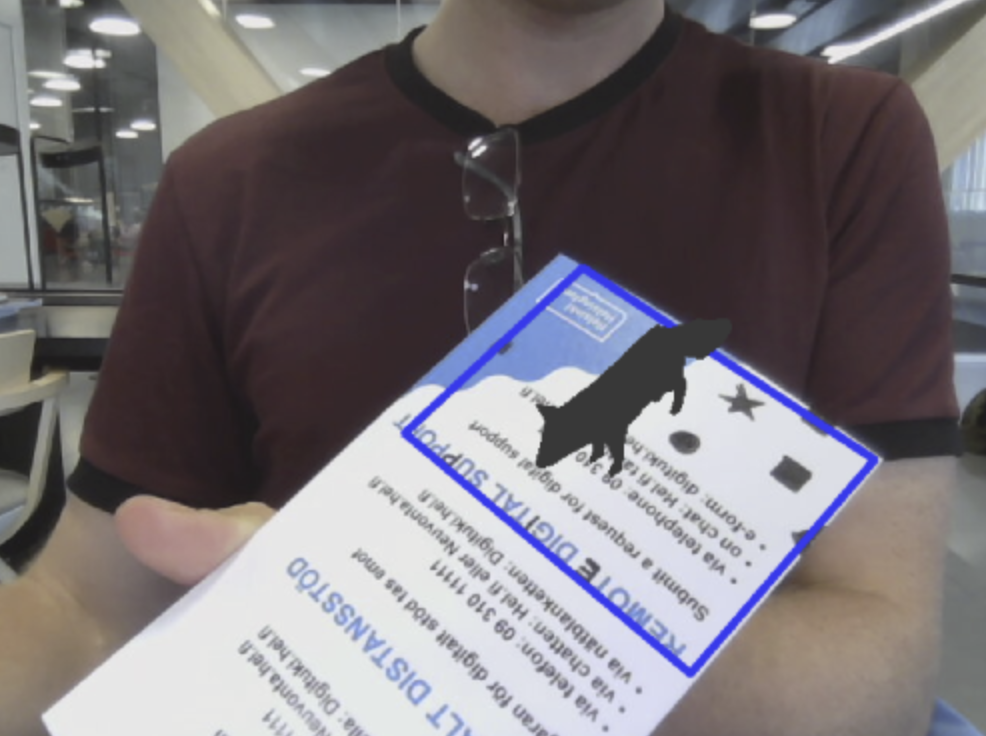
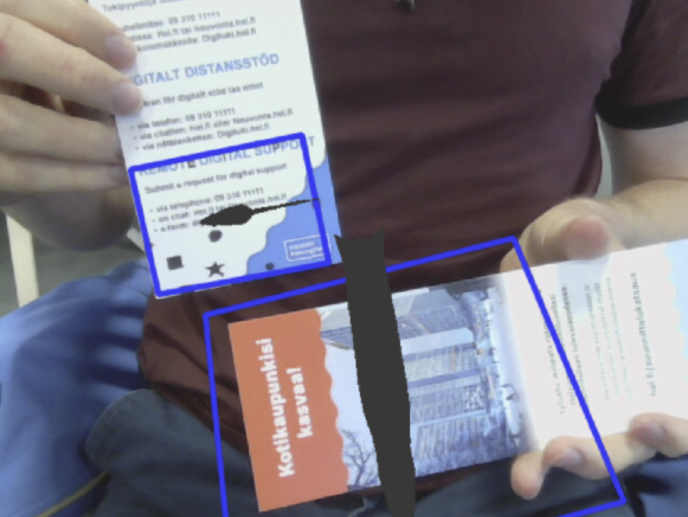

# augmented-reality

## Summary
Augmented reality card based application with Python, Numpy and OpenCV. The main idea is to use a reference image with enough distinct visual features. This reference image serves as a stage for the AR object to be placed on. Given an arbitrary frame, the algorithm tries to find this reference (can have different size and orientation). If successful, the transformation between the reference image and its occurence in the frame is found. The latter is used to add the AR object to the frame. This is a fork - please see the original [repository](https://github.com/juangallostra/augmented-reality) for more information.

## Usage

* Execute `python src/main.py` to run with default values - you should see: 
* Executing `python src/main.py --help` provides info on input arguments
* It is also possible to add multiple AR objects to a scene as follows `py src/main.py -r reference/reference_1.jpg reference/reference_0.jpg -o models/fox.obj models/rat.obj -i reference/reference_0_and_1_rot.jpg` which results in: 
* The `-i, --image` attempts to add AR objects to the single image specified. Adding `--video` argument attempts to add the AR objects to the stream from your webcam instead. The `-i, --image` options are ignored in that case.
